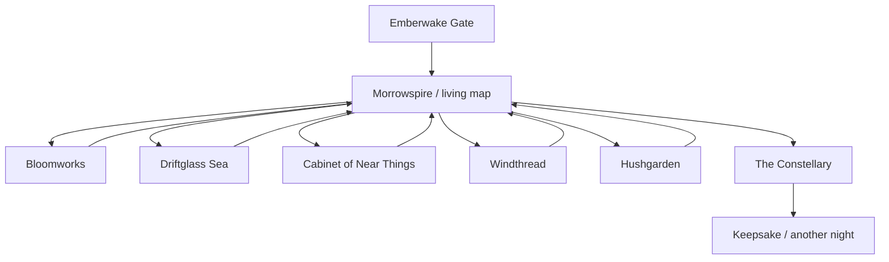

# MORROWLIGHT experience blueprint

Status: concept-gate draft owned by the primary agent  
Date: 2026-08-01 JST

## The promise

**MORROWLIGHT is a theme park that opens in the final light of one day and closes only after it has made a new tomorrow from the way you played.**

The park exists in the browser. The guest does not browse information about rides; they arrive, move through a remembered place, play attractions, discover quiet corners, and assemble a finale.

The emotional takeaway is not “I won.” It is: **“The park noticed how I played, and made something only this night could make.”**

## World premise

Morrowlight appears in the hour when daylight has left but night is not settled. Its makers collect “near tomorrows”: useful, funny, beautiful possibilities that people imagined but did not yet know how to build. Every guest is given one dim ember-star. Attractions do not grade the guest. They reveal motion, attention, and care through play, then teach the star how to shine.

The park has no villain and no lecture. Hope is expressed through responsive systems: a garden thrives by relationships, a sea becomes navigable by attention, discarded inventions become companions, and wind becomes a collaborator rather than an obstacle.

## Guest emotional arc

| Beat | Intended feeling | Guest action | Park response |
|---|---|---|---|
| Threshold | Curiosity | Touch/focus the last ember of sunset | The first star wakes immediately |
| Orientation | Anticipation | Open the living map and choose a landmark | A visible path threads itself across the park |
| First attraction | Capability | Learn one verb through play | The realm transforms and the star gains a motif |
| Free exploration | Ownership | Choose order, linger, revisit, find quiet details | Weather, creatures, and music reflect accumulated traces |
| Recognition | Being seen | Notice a previous action recur elsewhere | The park creates cross-attraction echoes |
| Gathering | Wonder | Bring at least three motifs to the Constellary | The skyline prepares a guest-specific procession |
| Finale | Release | Conduct or simply watch the sky-parade | Motifs combine into a deterministic personal composition |
| Farewell | Warmth | Save a local keepsake or begin another night | A compact “night code” preserves the seed without an account |

## Park topology

The map is a legible, asymmetric ring around a central landmark, **the Morrowspire**. The spire always indicates home and finale readiness. Each realm has a unique silhouette, motion signature, sound family, and route color. The guest can return to the map at any time.

The first three major attractions are available after arrival. Windthread becomes visually prominent after one completed attraction, preventing the map from presenting five equal choices at once. The Constellary opens after any three major attractions. Finishing all four, revisiting, and discovering Hushgarden details deepen the finale but are never required.

## Interaction grammar

The entire park teaches a small reusable grammar:

- **Navigate:** pointer/touch targets or arrow keys; a persistent map command always returns home.
- **Notice:** hover, focus, or move near a glimmer; no essential information is hover-only.
- **Act:** press, click/tap, Enter, or Space; each scene has one visually dominant action.
- **Shape:** hold, drag, or use paired directional controls; every gesture has a button/keyboard alternative.
- **Listen:** optional audio enriches but never carries sole instructions or state.

No attraction begins with a modal tutorial. The first safe action produces an exaggerated response, the second reveals a relationship, and the third introduces consequence.

## Attractions

### Emberwake Gate — ten-second wonder

The screen begins as a deep ink field with one warm ember and the invitation: “Touch the last light of today.” Pointer, touch, focus, or the primary key draws a short filament from the guest to the ember. It wakes into a small orbiting star, reveals the title by lighting its letterforms, and pulls the horizon into view.

This is also the accessibility threshold: motion, contrast, sound, and power controls are reachable before the cinematic expansion and can be changed without restarting.

### Bloomworks — relationship as machinery

A sleeping botanical machine fills the scene. The guest places or cycles three seed-gears among branching sockets. There is no single correct arrangement: close clusters create dense rhythm, distributed arrangements create long connective vines, and mixed arrangements invite luminous pollinators.

- Core verb: arrange and pulse.
- Immediate trace: each placement grows a responsive stem.
- Park trace: vines and pollinators later appear around the map.
- Star motif: petal geometry plus a rhythm profile.
- Replay depth: different arrangements reveal different resident creatures and bridge patterns.

### Driftglass Sea — attention steers

A paper-dark sea is crossed by translucent currents. The guest guides a small light skiff by leaning a wind ribbon with pointer/touch or paired controls. Three wandering lights broadcast distinct visible pulse patterns and optional tones. Whichever ones the guest follows become companions; missing one changes the voyage rather than failing it.

- Core verb: steer and attend.
- Immediate trace: currents remember the path as glowing glass.
- Park trace: chosen lights cross later skies and answer distant landmarks.
- Star motif: a trail, interval family, and current shape.
- Replay depth: alternate currents, quiet coves, and route-specific constellations.

### The Cabinet of Near Things — curiosity changes exhibits

An editorial, tactile room of impossible instruments: a pocket weather loom, an apology translator for birds, a staircase seed, a clock that measures enough. Looking closely activates mechanisms and short fragments. The guest adopts one near thing; it folds into a small companion object that appears elsewhere in the park.

- Core verb: inspect and adopt.
- Immediate trace: drawers, lenses, and annotations respond to attention.
- Park trace: the adopted object solves tiny ambient problems without becoming a power-up.
- Star motif: a sigil and verbal fragment.
- Replay depth: exhibits cross-reference previous nights and each other.

### Windthread — exhilaration without punishment

The guest rides a filament kite through a vertical cloudscape. Diving builds speed; catching updrafts creates height; threading rings paints the sky. A calm route and a daring route are equally authored. Collisions become billowing cloth and recover the guest rather than resetting progress.

- Core verb: lean and release.
- Immediate trace: the route is drawn as a persistent sky-thread.
- Park trace: flags, cloud speed, and map parallax adopt the guest’s movement profile.
- Star motif: tempo, arc, and flare behavior.
- Replay depth: route mastery and perspective secrets, not punitive score chasing.

### Hushgarden — the park’s breath

A non-required quiet space without a completion meter. Guests can slow the wind, read visual field notes, replay discovered tones, or do nothing while the park settles. It validates rest as participation and provides a natural place to surface accessibility controls without breaking the world.

### The Constellary — personalized finale

The Morrowspire unfolds into a sky instrument. The guest may conduct with the familiar primary action or select “let the park remember” and watch. The finale is assembled from earned motifs:

- Bloomworks determines growth geometry and rhythmic density.
- Driftglass determines color drift, companions, and harmonic intervals.
- Cabinet determines emblem, a short line of language, and one comic or tender event.
- Windthread determines camera energy, tempo, and trail movement.
- Discovery and revisit traces add small surprises, never checklist clutter.

The result is deterministic for the saved night, so replay and testing remain reliable. The climax resolves by returning the guest’s original ember-star, now visibly carrying every realm.

## Consequence ladder

Every material action should reach at least two levels:

1. **Touch:** response within 100 ms when feasible.
2. **Scene:** the current attraction visibly changes.
3. **Park:** the map, ambience, or another attraction echoes it.
4. **Finale:** a recognizable motif returns in the Constellary.

This prevents “choice” from being decorative while avoiding an exponential branching story.

## Short route, deep route, and replay

- **Short route (about 5 minutes):** Emberwake → any three abbreviated attraction cores → Constellary. Each attraction offers a graceful early completion after its central relationship is understood.
- **Discovery route (30–60 minutes):** all attractions, alternate arrangements/routes, Hushgarden, cross-attraction echoes, and hidden field notes.
- **Another night:** a fresh seed changes small layouts and combinations while learned controls remain. Returning guests may keep one adopted Near Thing, creating continuity without an account.

No global score, streak, currency shop, countdown, or dark pattern is permitted. Completion is invitation-driven, and leaving/reloading does not punish the guest.

## Keepsake

Generate a client-side SVG “Night Chart” containing the guest’s palette, route lines, motifs, title fragment, date, and compact seed code. It can be downloaded locally. The chart contains no personal data, remote upload, or mandatory social action.

## Failure and recovery as fiction

- Save corruption: preserve the old payload, start a recoverable “new dusk,” and explain plainly in settings.
- Audio blocked: show visible pulse notation and enable sound only after a guest gesture.
- Renderer overload: transition to the low-power illustrated scene without losing state.
- Interrupted attraction: save after meaningful actions and resume at a calm staging point.
- Offline/reload: core built assets remain usable; deployment caching strategy is decided separately.

## Originality guard

Morrowlight borrows no character, plot, music, attraction layout, trademarked name, or distinctive trade dress. Research may influence abstract principles such as landmark wayfinding, responsive agency, pacing, and multi-sensory reinforcement. Every named world element, piece of copy, visual asset, procedural motif, and audio phrase requires project provenance.
