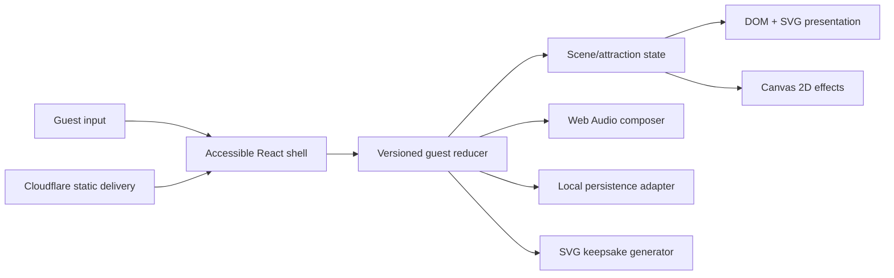

# MORROWLIGHT technical architecture

Status: concept-gate draft; Cloudflare constraints pending current-source review  
Date: 2026-08-01 JST

## Decision summary

Build a client-first TypeScript application with React for semantic application structure, SVG for the living map and authored illustration, Canvas 2D for optional projected ambience and dense visual feedback, and the Web Audio API for optional generative sound. Persist a versioned deterministic guest state locally. Deploy the static build with the smallest viable Cloudflare runtime.

This hybrid is deliberately 2D. Depth comes from composition, parallax, layering, lighting, sound, and stateful response rather than mandatory 3D navigation.

## Runtime boundaries



The reducer is the project’s center. Rendering, audio, persistence, keepsake, analytics, and tests observe the same events/state; they do not invent parallel progress models.

## Proposed source shape

```text
src/
  app/                 routing, shell, providers, error boundaries
  experience/          guest state, events, migrations, selectors
  scenes/              arrival, map, attractions, finale, keepsake
  engine/              frame loop, input normalization, seeded random
  audio/               optional Web Audio graph and visual cue mirror
  accessibility/       preferences, live regions, text guide, focus
  content/             typed authored copy and attraction definitions
  assets/              project-authored SVG and procedural definitions
  styles/              tokens, typography, layout, motion modes
  testing/             deterministic fixtures and page objects
tests/
  unit/
  e2e/
public/
  icons/               generated project marks
docs/
```

## Guest state

```ts
type GuestStateV1 = {
  schemaVersion: 1;
  nightId: string;
  seed: number;
  phase: 'arrival' | 'explore' | 'finale' | 'farewell';
  preferences: {
    audio: 'off' | 'on';
    motion: 'full' | 'reduced';
    contrast: 'standard' | 'high';
    power: 'auto' | 'low';
  };
  visited: string[];
  traces: {
    bloom?: BloomTrace;
    drift?: DriftTrace;
    cabinet?: CabinetTrace;
    wind?: WindTrace;
    discoveries: string[];
  };
  finale?: FinaleRecipe;
};
```

State transitions are pure and event-driven. The finale recipe is derived deterministically from the seed and traces, then stored so later code changes do not silently alter an existing keepsake. Save writes are debounced and also triggered after meaningful events.

## Scene contract

Every attraction exports:

- stable ID, display metadata, and availability selector;
- pure initial state from the night seed;
- accepted normalized actions;
- completion/early-completion rules;
- park-level trace contribution;
- semantic text-guide representation;
- reduced-motion/low-power presentation declaration;
- deterministic test fixtures.

This allows attractions to feel visually different without breaking navigation, saving, accessibility, or finale composition.

## Rendering

- React/DOM owns headings, instructions, buttons, dialogs, focus, live status, and failure UI.
- SVG owns the park map, route threads, scalable symbols, and keepsake.
- Canvas 2D owns optional particles, large repeated marks, current fields, and projected real-time feedback; DOM/SVG still own meaningful attraction controls and state representation.
- Canvas is never the sole carrier of instructions, progress, or interactive semantics.
- The frame scheduler pauses hidden scenes, caps delta time, adapts effect density, and stops when no animated layer is dirty.
- Full WebGL/WebGPU is rejected for the baseline. A later isolated effect may use it only with a measured benefit and an equivalent fallback.

## Input and accessibility

Normalize pointer, touch, keyboard, and optional gamepad into named intents such as `navigate`, `primary`, `shape`, `cancel`, and `map`. Attractions consume intents rather than device events.

Use semantic controls as the input source where possible. Canvas interactions receive mirrored DOM controls and status. Route changes move focus to a scene heading, while attraction updates use restrained live-region announcements. The app respects system reduced-motion/contrast preferences on first visit and lets the guest override them locally.

## Audio

Create/resume `AudioContext` only from an explicit guest gesture. The audio adapter consumes high-level musical events from state, so it can be disabled without changing gameplay. A visible cue adapter consumes the same events. Audio failures are contained and never fail a scene.

## Persistence and privacy

- Baseline uses localStorage behind an adapter with schema validation, migration, and corrupt-payload quarantine.
- No account, fingerprint, ad tracker, or user-generated content upload is required.
- A compact night code contains only seed and trace identifiers with a version/checksum; it is not a secret.
- Optional Cloudflare analytics or shared features require a separate capability/privacy gate.

## Deployment

Baseline target is one Cloudflare project serving immutable hashed assets plus SPA fallback. Exact Workers Static Assets/Pages selection and headers follow current official research. Do not add D1, R2, Durable Objects, KV, or a custom domain until a tested capability requires it.

Required environments:

- local development;
- local production preview;
- production Cloudflare deployment.

A separate preview project is optional and justified only if it improves safe live verification without confusing resource ownership.

## Performance envelope

Initial budgets, to be validated with the vertical slice:

- application JavaScript on the opening route: target under 250 KiB compressed;
- opening critical visual assets: target under 600 KiB compressed;
- no blocking remote font or media request;
- responsive input feedback within 100 ms for the primary action when the main thread is healthy;
- animation effects adapt to device preference and observed frame pressure;
- later attractions load on intent/idle rather than blocking Emberwake Gate.

Budgets are guardrails, not claims of achieved performance.

## Error boundaries and recovery

- Scene-level error boundaries return the guest to the map with state intact.
- Save parsing is fail-closed and never trusts unknown fields.
- Asset load failure has an illustrated/text fallback.
- Audio, optional installability, analytics, and keepsake download are independent failure domains.
- Deployment adds explicit security headers compatible with the built bundle and no secrets in client code.

## Verification stack

- TypeScript strict checking and ESLint/formatting.
- Vitest for reducer, migrations, seeded random, scene contracts, finale, and night-code round trips.
- React Testing Library for semantic input, focus, preferences, and error recovery.
- Playwright for critical paths and representative viewports/preferences.
- Batched screenshots after functional closure.
- Live URL smoke tests after deployment, logged separately.
